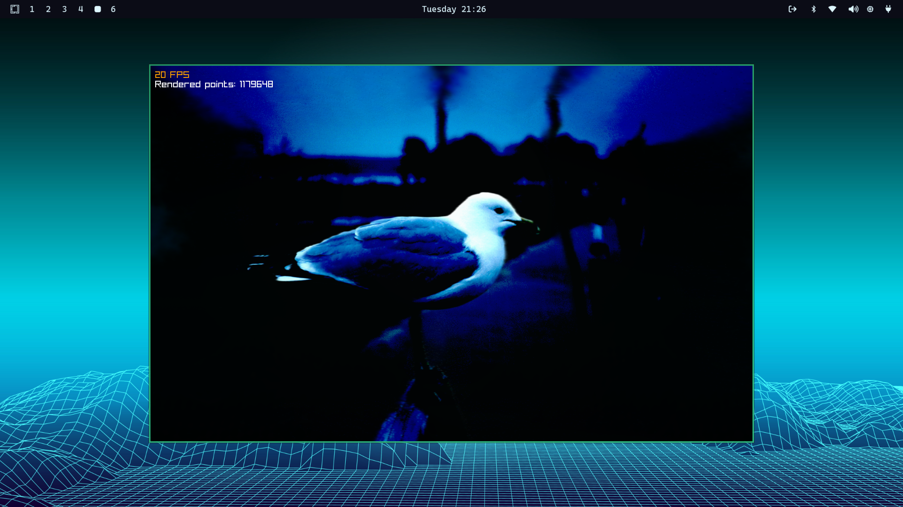

# Gaussian Splat Viewer

By Krzysztof Krystian Jankowski


[Download this seagule.ply](https://github.com/w84death/3dgs-viewer/releases/download/alpha6/seagule.ply)


## About

A 3D Gaussian splat viewer built with Raylib and Zig.

## Usage

- Download binary in [Releases](https://github.com/w84death/3dgs-viewer/releases) for your system (Linux 64 or Windows 64).
- Put **3dgl_viewer** next to the **.ply file**. Download this [seagule.ply](https://github.com/w84death/3dgs-viewer/releases/download/alpha6/seagule.ply) or [fish](https://github.com/w84death/3dgs-viewer/releases/download/alpha2/example.ply) as example.
- Run:

```
./3dgl_viewer
```

or 2x click **3dgl_viewer.exe** Windows.

## Tech
- Zig Lang
- Raylib


## Technical Features

The viewer supports the following features:

- **PLY File Loading**: Loads Gaussian splat data from binary PLY files, parsing properties like positions, scales, spherical harmonics (SH) coefficients for colors, and opacity. Converts SH coefficients to RGB values and opacity to alpha using sigmoid activation.
- **Camera Control**: Implements orbital camera with mouse drag for rotation (constrained to a range), dolly zoom effect with Q/W keys adjusting FOV while maintaining apparent size, and scene movement with arrow keys.
- **Level of Detail (LOD)**: Adjustable skip factor (1, 2, 5, 10, 25) via number keys to render only a subset of splats for performance.
- **Multi-threading**: Background sorting of splats by distance from camera when rotation stops, using double buffering to avoid frame drops.
- **Chunking**: Groups splats into chunks of up to 60,000 for efficient GPU rendering and memory management.
- **Dynamic Rebuilding**: Recreates meshes when splat data changes (loading new files or adjusting LOD).
- **Loading Animation**: Displays a loading screen when switching between PLY files via space bar.

## Rendering Techniques

The rendering pipeline:

- **Billboarded Quad Rendering**: Each Gaussian splat is rendered as a billboarded quad (two triangles, 6 vertices) oriented towards the camera using the view matrix.
- **Vertex Shader**: Positions quad corners based on texture coordinates, scales the quad using splat scale stored in normal vectors, and centers at the splat position.
- **Fragment Shader**: Applies Gaussian alpha falloff (exp(-r² * 10)) within a radius of 0.5, discards fragments outside, and corrects gamma to sRGB space.
- **Depth Sorting**: Sorts splats back-to-front by squared distance from camera to handle transparency without depth buffer artifacts.
- **Alpha Blending**: Disables depth mask and backface culling during rendering to allow proper blending of translucent splats.
- **Mesh Generation**: Builds dynamic meshes per chunk with scratch buffers for vertices, texcoords, normals (scales), and colors.

## Building
```
zig build -Doptimize=ReleaseFast upx
zig build -Dtarget=x86_64-windows -Doptimize=ReleaseFast upx
```
