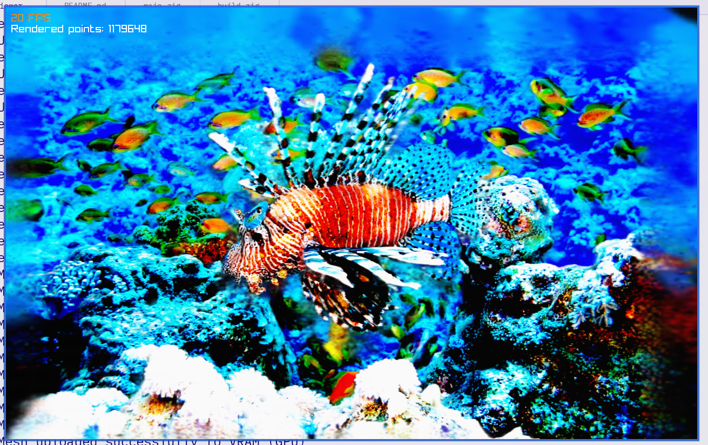

# Gaussian Splat Viewer

By Krzysztof Krystian Jankowski



## About

A 3D Gaussian splat viewer built with Raylib and Zig.

## Tech
- Zig Lang
- Raylib

## Building
```
zig build run
zig build -Doptimize=ReleaseFast upx
zig build -Dtarget=x86_64-windows -Doptimize=ReleaseFast upx
```
